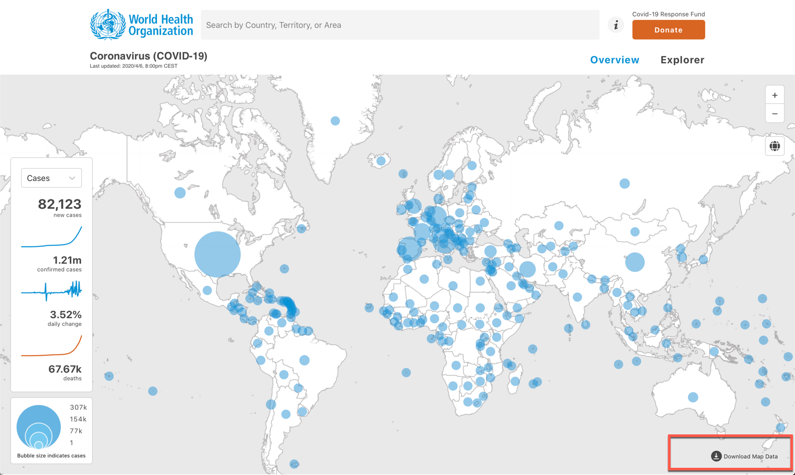

# Using Pandas to look at Pandemic Data

The script and supporting files in this repository are intended to show how the Python Pandas module can be used to analyze data, specifically COVID-19 data.

I am going to recommend 3 data sets to "investigate":

- [WHO](https://who.sprinklr.com/) (Download from 06 April 2020)

- [CSSEGISandData on GitHub](https://github.com/CSSEGISandData)

- [New York Times US Data GitHub Repository](https://github.com/nytimes/covid-19-data)

  

## WHO Data

The repository comes with the WHO data file from 06 April 2020 (WHO-COVID-19-global-data.csv).     The simplest run of the script will use this WHO data file.

To download the latest file go to the [Who Overview Map](https://who.sprinklr.com) and download the Map Data from the link on the lower right hand side.

This CSV file will need clean up.  Remove spaces from column titles.  Some rows have spaces in the country names and so spaces have shifted columns (Belize and Palestine).  You will need to combine the name and shift the data back to the correct columns.  Welcome to the world of data.



## 

##John Hopkins University (JHU) Center for Systems Science and Engineering (CSSE) Data

The [John Hopikns Unversity CSSE](https://systems.jhu.edu/) data is widely used in the media and either drives or is incorporated into many other data sets.  More importantly for our purposes,  this wonderful instisituion of higher learning makes the raw data available on a pulbic repository (GitHub).

[CSSEGISandData on GitHub](https://github.com/CSSEGISandData)

I've cloned the repository so that it sits as a subdirectory in my pandas_for_pandemic_data folder and I refresh it every day.

```git
# Clones the pands_for_pandemic_data Repository
git clone https://github.com/cldeluna/pandas_for_pandemic_data.git

# Change into the pands_for_pandemic_data Repository
cd pandas_for_pandemic_data

# Clones the John Hopikns Unversity CSSE Data
git clone https://github.com/CSSEGISandData/COVID-19.git

# Refresh the JHU Data
cd COVID-19
git pull
```

```
# Exammple of refreshing the JHU repository
Claudias-iMac:COVID-19 claudia$ git pull
remote: Enumerating objects: 148, done.
remote: Counting objects: 100% (148/148), done.
remote: Compressing objects: 100% (13/13), done.
remote: Total 252 (delta 135), reused 140 (delta 135), pack-reused 104
Receiving objects: 100% (252/252), 1.25 MiB | 6.51 MiB/s, done.
Resolving deltas: 100% (157/157), completed with 14 local objects.
From https://github.com/CSSEGISandData/COVID-19
   865c933c..f3dea791  master     -> origin/master
   513b21a4..493821d3  web-data   -> origin/web-data
Updating 865c933c..f3dea791
Fast-forward
 csse_covid_19_data/UID_ISO_FIPS_LookUp_Table.csv   | 7141 ++++++++++----------
 .../csse_covid_19_daily_reports/04-06-2020.csv     | 2810 ++++++++
 .../time_series_covid19_confirmed_US.csv           | 6508 +++++++++---------
 .../time_series_covid19_confirmed_global.csv       |  527 +-
 .../time_series_covid19_deaths_US.csv              | 6508 +++++++++---------
 .../time_series_covid19_deaths_global.csv          |  527 +-
 .../time_series_covid19_recovered_global.csv       |  499 +-
 7 files changed, 13668 insertions(+), 10852 deletions(-)
 create mode 100644 csse_covid_19_data/csse_covid_19_daily_reports/04-06-2020.csv
Claudias-iMac:COVID-19 claudia$
```


Feel free to put it elsewhere in your directory structure.  The script sets the default path in the arguments section at the bottom.  You can either update the default path directly or use the -d option when you execute the script to redirect script to look there for the daily files.


## New York Times Data


The New York Times has also shared their data.   This repository only contains data for the US.  They share two flavors: 

- US State Level data 

- US County Level data

They do a good job of keeing the data set very clean.  Its all numeric and so far I've not seen any missing data which is rare for any data set.

```
== Number of MISSING values in each column:
date      0
state     0
fips      0
cases     0
deaths    0
dtype: int64
```

[New York Times US Data GitHub Repository](https://github.com/nytimes/covid-19-data)

I took the same apporach with this repository as I did for the JHU data.   I've cloned the repository so that it sits as a subdirectory in my pandas_for_pandemic_data folder and I refresh it every day. 


## Script

In general, the script will take in a CSV data file, turn it into a Pandas Data Frame, and execute a set of commands against the data.

- Describe the data (pandas method showing interesting statistical facts about the data)

- Show the shape of the data frame (number of rows and columns)

- Show the first and last 5 lines of data

- List the column headings 

- Show the data type of each column

- Look for the total number of missing values in each column

- Sum the columns (only makes sense for columns holding numeric data)

The various options let you control which data set you want to investigate and filter.  The output is sent to your screen.   These are just some of the actions available to you with Pandas.  Once you have the data in a Pandas data frame you can query the data frame for the data that is meaningful to you.

##### Cheatsheet for ***todays_totals.py*** script

| CLI                                                          | Description                                                  |
| ------------------------------------------------------------ | ------------------------------------------------------------ |
| python todays_totals.py -h                                   | Display all the options available (Help)                     |
| python todays_totals.py                                      | <br/>WHO Data<br/>Without any options, the script will load the local WHO data file from 6 April into a Pandas Data Frame and run some commands to investigate the data.<br/>Reminder: If you download a fresh WHO CSV file please note the updates I list above so that you can cleanly import the CSV into a Data Frame. |
| python todays_totals.py -c "MX"                              | <br/>WHO Data Filtered for a Specific Country<br/><br/>Note: use the 2 letter country code as an argument with the -c option |
| python todays_totals.py -t                                   | John Hopikns Unversity CSSE Data<br/><br/>The -t option will look for todays daily log file in the JHU CSSE (remember to clone the repository) |
| python todays_totals.py -t -c "Mexico"                       | John Hopikns Unversity CSSE Data<br/><br/>The -t -c "country or region" option will let you filter for a country |
| python todays_totals.py -t -s "California"                   | John Hopikns Unversity CSSE Data<br/><br/>The -t -s "state" option filters the JHU data set for a state or province |
| python todays_totals.py -t -f 06037                          | John Hopikns Unversity CSSE Data<br/>  <br/>The -t -f  [FIPS](https://www.nrcs.usda.gov/wps/portal/nrcs/detail/national/home/?cid=nrcs143_013697) option filters the JHU data set for a FIPS county code.   Note: FIPS code 06037 is for Los Angeles County |
| python todays_totals.py -n                                   | New York Times Data<br/><br/>US Totals Only for the full NY Times data set<br/>(remember to clone the repository) |
| python todays_totals.py -n -f 6<br/>or<br/>python todays_totals.py -n -p "California" | New York Times Data<br/><br/><br/>This data set has both "state" and "fips" but fips represents [FIPS State Code](Federal Information Processing Standard state code) so in this example 6 is the FIPS state code.  This should get you exactly the same data as ** python todays_totals.py -n -p "California"** |

The ***todays_totals.py*** script will give you an idea of how to load pandemic data into a Pandas data frame and interrogate the data.  Executing it with the ***-h*** option will give you help on the options.

```python
(pandas) Claudias-iMac:pandas_for_pandemic_data claudia$ python todays_totals.py -h
usage: todays_totals.py [-h] [-d DAILY_REPORTS_FOLDER] [-c COUNTRY_REGION]
                        [-p PROVINCE_STATE] [-s SPECIFIC_DAY] [-f FIPS] [-w]
                        [-t] [-n]

Script Description

optional arguments:
  -h, --help            show this help message and exit
  -d DAILY_REPORTS_FOLDER, --daily_reports_folder DAILY_REPORTS_FOLDER
                        Set path to CSSE Dailty Report folder
                        csse_covid_19_daily_reports. Default is ./COVID-19/css
                        e_covid_19_data/csse_covid_19_daily_reports
  -c COUNTRY_REGION, --country_region COUNTRY_REGION
                        Filer on 2 letter Country Region. Example: "US"
  -p PROVINCE_STATE, --province_state PROVINCE_STATE
                        Filer on Province State. Example: "California"
  -s SPECIFIC_DAY, --specific_day SPECIFIC_DAY
                        File for specific day. Example: 04-01-2020
  -f FIPS, --fips FIPS  FIPS County Code Example: 06037 (Los Angeles County)
  -w, --who_data_file   Analyze the WHO data file provided
  -t, --today_csse      Analyze todays file in the CSSE repo
  -n, --new_york_times  Analyze the New York Times Data

Usage: 'python todays_totals'
```

Running the script without any parameters yields some information on the WHO data set from 6 April which is part of the repository.   This information includes:

A description of the data frame including some statistical data on the numeric values.

The rows and 

Example output for WHO Data:

```
(pandas) Claudias-iMac:pandas_for_pandemic_data claudia$ python todays_totals.py


====================  DATA FRAME CHECK ====================
====================  WHO Data Frame from WHO-COVID-19-global-data.csv ====================


== Describe the Data Frame: 
            Deaths  CumulativeDeaths     Confirmed  CumulativeConfirmed
count  6786.000000       6786.000000   6786.000000          6786.000000
mean      9.971412        104.946360    178.487179          2313.689213
std      73.268455        761.569677   1183.935476         12918.006118
min       0.000000          0.000000      0.000000             1.000000
25%       0.000000          0.000000      0.000000             4.000000
50%       0.000000          0.000000      2.000000            26.000000
75%       0.000000          3.000000     25.000000           235.000000
max    2003.000000      15889.000000  33510.000000        307318.000000

== Shape of the Data Frame: 
(6786, 8)

== SAMPLE (first and last 5 rows):
       day Country  CountryName Region  Deaths  CumulativeDeaths  Confirmed  CumulativeConfirmed
0  2/25/20      AF  Afghanistan   EMRO       0                 0          1                    1
1  2/26/20      AF  Afghanistan   EMRO       0                 0          0                    1
2  2/27/20      AF  Afghanistan   EMRO       0                 0          0                    1
3  2/28/20      AF  Afghanistan   EMRO       0                 0          0                    1
4  2/29/20      AF  Afghanistan   EMRO       0                 0          0                    1
         day Country CountryName Region  Deaths  CumulativeDeaths  Confirmed  CumulativeConfirmed
6781  4/2/20      ZW    Zimbabwe   AFRO       0                 1          0                    8
6782  4/3/20      ZW    Zimbabwe   AFRO       0                 1          0                    8
6783  4/4/20      ZW    Zimbabwe   AFRO       0                 1          1                    9
6784  4/5/20      ZW    Zimbabwe   AFRO       0                 1          0                    9
6785  4/6/20      ZW    Zimbabwe   AFRO       0                 1          0                    9

== Column Headings of the data set: 
['day' 'Country' 'CountryName' 'Region' 'Deaths' 'CumulativeDeaths'
 'Confirmed' 'CumulativeConfirmed']


== Column default data type: 
day                    object
Country                object
CountryName            object
Region                 object
Deaths                  int64
CumulativeDeaths        int64
Confirmed               int64
CumulativeConfirmed     int64
dtype: object


== Number of MISSING values in each column:
day                     0
Country                85
CountryName             0
Region                 62
Deaths                  0
CumulativeDeaths        0
Confirmed               0
CumulativeConfirmed     0
dtype: int64

== Sum just the numeric columns in the Data Frame:
Deaths                    67666
CumulativeDeaths         712166
Confirmed               1211214
CumulativeConfirmed    15700695
dtype: int64
(pandas) Claudias-iMac:pandas_for_pandemic_data claudia$ 
```
